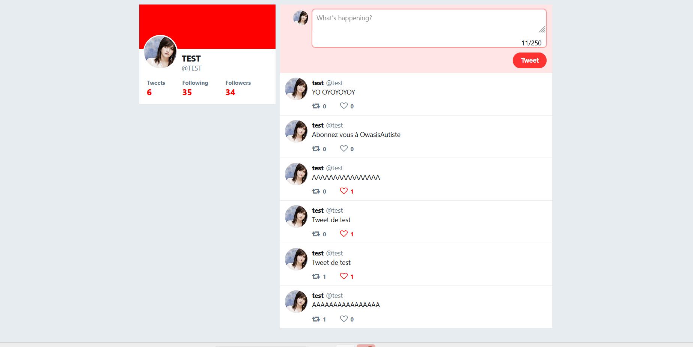

# Clone de Twitter;
Ce projet est un clone de Twitter, effectué par @Dunebook sur Github. Il permets de recréer le front de Twitter et de l'utiliser à sa guise.

Ce projet n'utilise pas de serveur ou base de données, il est uniquement basé sur du HTML, JavaScript, et du CSS afin de recréer une image de Twitter et la personnaliser à sa guise, pour un projet personnel ou autre !

Construit avec :
-HTML
-CSS
-JQuery

Installation : 
Pour installer ce projet, il faut avoir Git sur sa machine afin de pouvoir le cloner via, le lien HTML, SSH ou Github CLI : 

1. Clonez le repo :

https://github.com/Dunebook/Twitterclone.git

2. Ouvrez le projet via un éditeur ou même un navigateur.

Usage :

Vous pouvez voir la démonstration des différentes pages, par exemple le login :

Ou encore le profil :

La documentation complète est trouvable ici : -https://codesource.io/building-a-twitter-clone-using-jquery/
